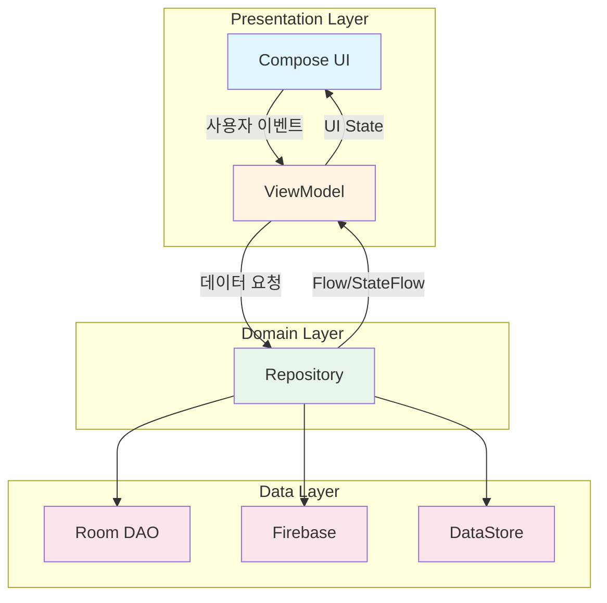
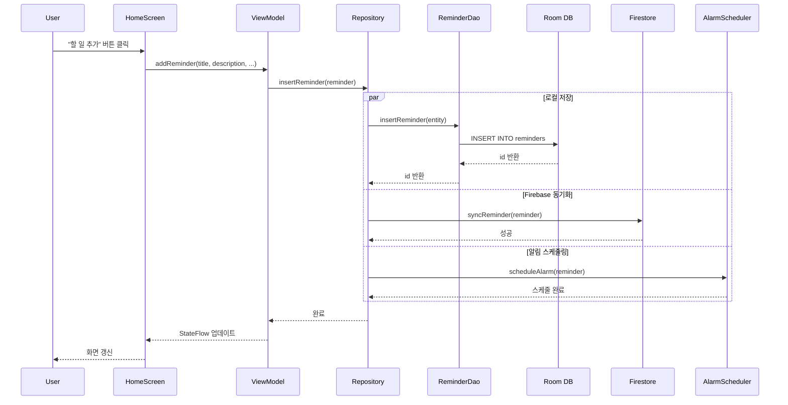
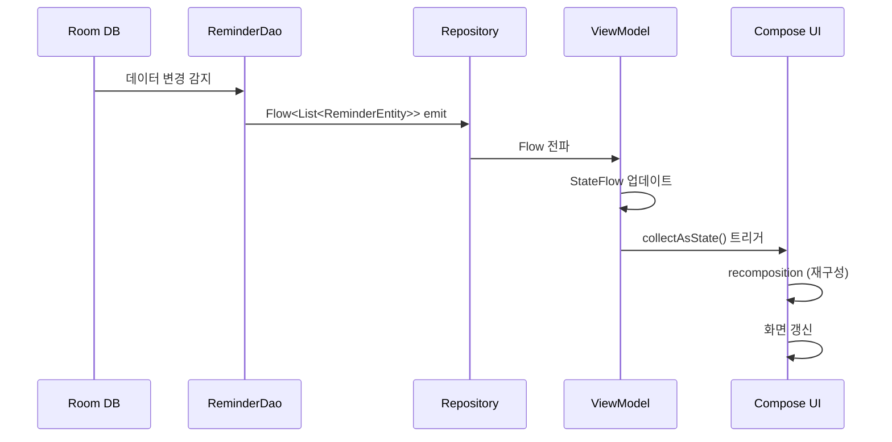
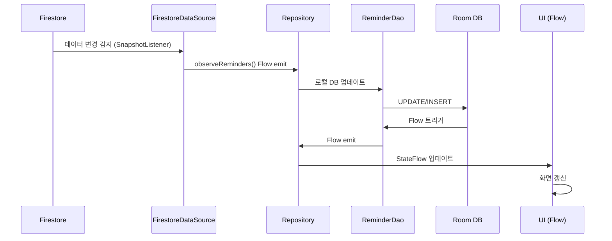

# 🏗️ Reminder 앱 아키텍처 문서

> 이 문서는 Reminder 앱의 전체 아키텍처를 상세히 설명합니다.

## 📋 목차

- [개요](#개요)
- [아키텍처 패턴](#아키텍처-패턴)
- [레이어 구조](#레이어-구조)
- [데이터 플로우](#데이터-플로우)
- [주요 컴포넌트](#주요-컴포넌트)
- [디자인 패턴](#디자인-패턴)
- [의존성 관리](#의존성-관리)
- [성능 최적화](#성능-최적화)
- [테스트 전략](#테스트-전략)

## 개요

Reminder 앱은 **MVVM (Model-View-ViewModel) 아키텍처**를 기반으로 하며, **Clean Architecture** 원칙을 따릅니다. 각 레이어는 명확한 책임을 가지며, 단방향 의존성을 유지합니다.

### 핵심 원칙

1. **관심사의 분리 (Separation of Concerns)**: UI, 비즈니스 로직, 데이터 레이어 분리
2. **단일 진실 공급원 (Single Source of Truth)**: Repository를 통한 데이터 관리
3. **단방향 데이터 플로우**: UI → ViewModel → Repository → Data Source
4. **반응형 프로그래밍**: Flow와 StateFlow를 통한 데이터 관찰
5. **테스트 가능성**: 각 레이어는 독립적으로 테스트 가능

## 아키텍처 패턴

### MVVM 아키텍처



### 레이어 책임

| 레이어 | 책임 | 주요 컴포넌트 |
|--------|------|---------------|
| **UI Layer** | 화면 렌더링, 사용자 입력 처리 | Compose Screens, UI Components |
| **ViewModel Layer** | UI 상태 관리, 비즈니스 로직 | ReminderViewModel, SettingsViewModel |
| **Repository Layer** | 데이터 소스 통합 및 추상화 | ReminderRepository |
| **Data Source Layer** | 실제 데이터 저장/동기화 | Room, Firebase, DataStore |

## 레이어 구조

### 1. UI Layer (Presentation)

#### 역할
- 사용자에게 데이터를 표시
- 사용자 입력을 ViewModel로 전달
- UI 상태 변화에 반응

#### 주요 컴포넌트

**Screens (화면)**
```
ui/screen/
├── HomeScreen.kt              # 메인 리마인더 리스트
├── AddEditReminderScreen.kt   # 리마인더 추가/수정
├── StatisticsScreen.kt        # 통계 대시보드
├── PatternAnalysisScreen.kt   # 완료 패턴 분석
├── SettingsScreen.kt          # 앱 설정
├── HelpScreen.kt              # 도움말
└── CompletionHistoryScreen.kt # 완료 이력 달력
```

**Components (재사용 컴포넌트)**
```
ui/components/
├── ReminderCard.kt            # 리마인더 카드
├── SubtaskItem.kt             # 서브태스크 아이템
├── FilterChip.kt              # 필터 칩
└── PriorityIndicator.kt       # 우선순위 표시기
```

#### 특징
- **State Hoisting**: 모든 상태는 ViewModel에서 관리
- **Stateless Composables**: 재사용 가능한 UI 컴포넌트
- **Side Effects**: LaunchedEffect, DisposableEffect로 관리

#### 예시 코드

```kotlin
@Composable
fun HomeScreen(
    viewModel: ReminderViewModel,
    onAddClick: () -> Unit,
    onReminderClick: (ReminderEntity) -> Unit
) {
    // UI 상태 수집
    val reminders by viewModel.allReminders.collectAsState()
    val filterState by viewModel.filterState.collectAsState()

    Scaffold(
        topBar = { HomeTopAppBar() },
        floatingActionButton = {
            FloatingActionButton(onClick = onAddClick) {
                Icon(Icons.Default.Add, contentDescription = "할 일 추가")
            }
        }
    ) { paddingValues ->
        LazyColumn(modifier = Modifier.padding(paddingValues)) {
            items(reminders, key = { it.id }) { reminder ->
                ReminderCard(
                    reminder = reminder,
                    onReminderClick = { onReminderClick(reminder) },
                    onToggleComplete = { viewModel.toggleReminderCompletion(it) },
                    onDeleteClick = { viewModel.deleteReminder(it) }
                )
            }
        }
    }
}
```

### 2. ViewModel Layer

#### 역할
- UI 상태를 관리하고 노출
- 비즈니스 로직 처리
- Repository와 UI 사이의 중개자

#### 주요 클래스

**ReminderViewModel**
```kotlin
class ReminderViewModel(
    private val repository: ReminderRepository
) : ViewModel() {

    // UI 상태 (StateFlow)
    private val _allReminders = MutableStateFlow<List<ReminderEntity>>(emptyList())
    val allReminders: StateFlow<List<ReminderEntity>> = _allReminders.asStateFlow()

    private val _filterState = MutableStateFlow(FilterState())
    val filterState: StateFlow<FilterState> = _filterState.asStateFlow()

    init {
        // Repository에서 데이터 수집
        viewModelScope.launch {
            repository.getAllReminders().collect { reminders ->
                _allReminders.value = reminders
            }
        }
    }

    // 비즈니스 로직
    fun addReminder(title: String, description: String, ...) {
        viewModelScope.launch {
            val reminder = ReminderEntity(
                title = title,
                description = description,
                // ...
            )
            repository.insertReminder(reminder)
        }
    }

    fun toggleReminderCompletion(reminder: ReminderEntity) {
        viewModelScope.launch {
            repository.toggleReminderCompletion(reminder.id)
        }
    }

    fun applyFilter(priority: Priority?, dateFilter: DateFilter?) {
        _filterState.value = FilterState(
            priority = priority,
            dateFilter = dateFilter
        )
    }
}
```

**SettingsViewModel**
```kotlin
class SettingsViewModel(
    private val dataStore: DataStore<Preferences>
) : ViewModel() {

    val userPreferences: StateFlow<UserPreferences> = dataStore.data
        .map { preferences ->
            UserPreferences(
                themeMode = ThemeMode.valueOf(
                    preferences[THEME_MODE] ?: ThemeMode.SYSTEM.name
                ),
                fontSize = FontSize.valueOf(
                    preferences[FONT_SIZE] ?: FontSize.NORMAL.name
                ),
                simpleMode = preferences[SIMPLE_MODE] ?: false
            )
        }
        .stateIn(
            scope = viewModelScope,
            started = SharingStarted.WhileSubscribed(5000),
            initialValue = UserPreferences()
        )

    fun updateThemeMode(mode: ThemeMode) {
        viewModelScope.launch {
            dataStore.edit { preferences ->
                preferences[THEME_MODE] = mode.name
            }
        }
    }
}
```

#### 특징
- **ViewModel Scope**: 코루틴 생명주기 자동 관리
- **StateFlow**: UI 상태를 반응형으로 노출
- **No Android Dependencies**: Context, Activity 의존성 없음
- **Testable**: 유닛 테스트 가능

### 3. Repository Layer

#### 역할
- 여러 데이터 소스를 통합
- 단일 진실 공급원 제공
- 데이터 캐싱 및 동기화

#### ReminderRepository

```kotlin
class ReminderRepository(
    private val reminderDao: ReminderDao,
    private val firestoreDataSource: FirestoreDataSource,
    private val alarmScheduler: AlarmScheduler
) {
    // 로컬 데이터베이스에서 데이터 스트림
    fun getAllReminders(): Flow<List<ReminderEntity>> {
        return reminderDao.getAllReminders()
    }

    // CRUD 작업
    suspend fun insertReminder(reminder: ReminderEntity): Long {
        // 1. 로컬 DB에 저장 (오프라인 우선)
        val id = reminderDao.insertReminder(reminder)

        // 2. Firebase 동기화 (백그라운드)
        try {
            firestoreDataSource.syncReminder(reminder.copy(id = id))
        } catch (e: Exception) {
            Log.e("Repository", "Firebase sync failed", e)
            // 오프라인 모드에서도 정상 동작
        }

        // 3. 알림 스케줄링
        if (reminder.dueDateTime != null) {
            alarmScheduler.scheduleAlarm(reminder)
        }

        return id
    }

    suspend fun updateReminder(reminder: ReminderEntity) {
        reminderDao.updateReminder(reminder)
        firestoreDataSource.syncReminder(reminder)

        // 알림 재스케줄링
        alarmScheduler.cancelAlarm(reminder.id)
        if (reminder.dueDateTime != null) {
            alarmScheduler.scheduleAlarm(reminder)
        }
    }

    suspend fun deleteReminder(reminder: ReminderEntity) {
        reminderDao.deleteReminder(reminder)
        firestoreDataSource.deleteReminder(reminder.id)
        alarmScheduler.cancelAlarm(reminder.id)
    }

    suspend fun toggleReminderCompletion(id: Long) {
        reminderDao.toggleReminderCompletion(id)
        // Firebase 동기화는 Flow를 통해 자동으로 처리
    }
}
```

#### 특징
- **로컬 우선 (Offline-First)**: Room을 주 데이터 소스로 사용
- **자동 동기화**: Firebase와 백그라운드 동기화
- **에러 처리**: 네트워크 오류 시에도 로컬 작업 보장
- **비즈니스 로직 통합**: 알림 스케줄링 등

### 4. Data Source Layer

#### 4.1 Room Database

**ReminderDao**
```kotlin
@Dao
interface ReminderDao {
    @Query("SELECT * FROM reminders ORDER BY due_date_time ASC")
    fun getAllReminders(): Flow<List<ReminderEntity>>

    @Query("SELECT * FROM reminders WHERE id = :id")
    suspend fun getReminderById(id: Long): ReminderEntity?

    @Insert(onConflict = OnConflictStrategy.REPLACE)
    suspend fun insertReminder(reminder: ReminderEntity): Long

    @Update
    suspend fun updateReminder(reminder: ReminderEntity)

    @Delete
    suspend fun deleteReminder(reminder: ReminderEntity)

    @Query("UPDATE reminders SET is_completed = NOT is_completed WHERE id = :id")
    suspend fun toggleReminderCompletion(id: Long)

    // 인덱스 활용 쿼리
    @Query("SELECT * FROM reminders WHERE is_completed = :completed")
    fun getRemindersByCompletionStatus(completed: Boolean): Flow<List<ReminderEntity>>

    @Query("SELECT * FROM reminders WHERE priority = :priority")
    fun getRemindersByPriority(priority: Priority): Flow<List<ReminderEntity>>
}
```

**ReminderEntity**
```kotlin
@Entity(
    tableName = "reminders",
    indices = [
        Index("is_completed"),
        Index("due_date_time"),
        Index("priority"),
        Index("category")
    ]
)
data class ReminderEntity(
    @PrimaryKey(autoGenerate = true)
    val id: Long = 0,

    val title: String,
    val description: String = "",
    val dueDateTime: LocalDateTime? = null,
    val priority: Priority = Priority.MEDIUM,
    val category: String = "",
    val isCompleted: Boolean = false,

    // v1.22.0 - 위치 기반
    val locationLatitude: Double? = null,
    val locationLongitude: Double? = null,
    val locationName: String? = null,
    val locationRadius: Int? = null,

    // v1.23.0 - 웹 링크
    val webLink: String? = null,

    // v1.24.0 - TTS
    val readAloud: Boolean = false,

    // 메타데이터
    val createdAt: LocalDateTime = LocalDateTime.now(),
    val updatedAt: LocalDateTime = LocalDateTime.now(),

    // 반복 설정
    val recurrencePattern: RecurrencePattern? = null,
    val recurrenceInterval: Int? = null,
    val recurrenceEndDate: LocalDateTime? = null,
    val selectedDaysOfWeek: List<DayOfWeek>? = null
)
```

**Type Converters**
```kotlin
class Converters {
    private val formatter = DateTimeFormatter.ISO_LOCAL_DATE_TIME

    @TypeConverter
    fun fromTimestamp(value: String?): LocalDateTime? {
        return value?.let { LocalDateTime.parse(it, formatter) }
    }

    @TypeConverter
    fun dateToTimestamp(date: LocalDateTime?): String? {
        return date?.format(formatter)
    }

    @TypeConverter
    fun fromPriority(priority: Priority): String {
        return priority.name
    }

    @TypeConverter
    fun toPriority(value: String): Priority {
        return Priority.valueOf(value)
    }
}
```

#### 4.2 Firebase Firestore

**FirestoreDataSource**
```kotlin
class FirestoreDataSource(
    private val firestore: FirebaseFirestore,
    private val auth: FirebaseAuth
) {
    private val remindersCollection = firestore.collection("reminders")

    suspend fun syncReminder(reminder: ReminderEntity) {
        val userId = auth.currentUser?.uid ?: return

        try {
            remindersCollection
                .document(userId)
                .collection("user_reminders")
                .document(reminder.id.toString())
                .set(reminder.toMap())
                .await()
        } catch (e: Exception) {
            throw createUserFriendlyException(e)
        }
    }

    suspend fun deleteReminder(id: Long) {
        val userId = auth.currentUser?.uid ?: return

        remindersCollection
            .document(userId)
            .collection("user_reminders")
            .document(id.toString())
            .delete()
            .await()
    }

    fun observeReminders(): Flow<List<ReminderEntity>> = callbackFlow {
        val userId = auth.currentUser?.uid ?: run {
            close()
            return@callbackFlow
        }

        val listener = remindersCollection
            .document(userId)
            .collection("user_reminders")
            .addSnapshotListener { snapshot, error ->
                if (error != null) {
                    close(error)
                    return@addSnapshotListener
                }

                val reminders = snapshot?.documents?.mapNotNull { doc ->
                    doc.toObject(ReminderEntity::class.java)
                } ?: emptyList()

                trySend(reminders)
            }

        awaitClose { listener.remove() }
    }

    private fun createUserFriendlyException(error: Exception): Exception {
        return when (error) {
            is FirebaseNetworkException -> {
                Exception("네트워크 연결을 확인해주세요.", error)
            }
            is FirebaseFirestoreException -> {
                when (error.code) {
                    FirebaseFirestoreException.Code.PERMISSION_DENIED -> {
                        Exception("데이터 접근 권한이 없습니다. 다시 로그인해주세요.", error)
                    }
                    FirebaseFirestoreException.Code.UNAVAILABLE -> {
                        Exception("잠시 후 다시 시도해주세요.", error)
                    }
                    FirebaseFirestoreException.Code.DEADLINE_EXCEEDED -> {
                        Exception("네트워크 연결을 확인해주세요.", error)
                    }
                    else -> Exception("알 수 없는 오류가 발생했습니다: ${error.message}", error)
                }
            }
            else -> Exception("알 수 없는 오류가 발생했습니다: ${error.message}", error)
        }
    }
}
```

#### 4.3 DataStore (설정 저장)

```kotlin
class UserPreferencesRepository(
    private val dataStore: DataStore<Preferences>
) {
    val userPreferences: Flow<UserPreferences> = dataStore.data
        .catch { exception ->
            if (exception is IOException) {
                emit(emptyPreferences())
            } else {
                throw exception
            }
        }
        .map { preferences ->
            UserPreferences(
                themeMode = ThemeMode.valueOf(
                    preferences[PreferencesKeys.THEME_MODE] ?: ThemeMode.SYSTEM.name
                ),
                fontSize = FontSize.valueOf(
                    preferences[PreferencesKeys.FONT_SIZE] ?: FontSize.NORMAL.name
                ),
                dynamicColor = preferences[PreferencesKeys.DYNAMIC_COLOR] ?: true,
                simpleMode = preferences[PreferencesKeys.SIMPLE_MODE] ?: false,
                notificationSound = preferences[PreferencesKeys.NOTIFICATION_SOUND] ?: true,
                notificationVibration = preferences[PreferencesKeys.NOTIFICATION_VIBRATION] ?: true,
                badgeEnabled = preferences[PreferencesKeys.BADGE_ENABLED] ?: true
            )
        }

    suspend fun updateThemeMode(mode: ThemeMode) {
        dataStore.edit { preferences ->
            preferences[PreferencesKeys.THEME_MODE] = mode.name
        }
    }
}
```

## 데이터 플로우

### 1. 사용자 액션 → 데이터 저장



### 2. 데이터 변경 → UI 업데이트



### 3. Firebase 실시간 동기화



## 주요 컴포넌트

### Navigation

```kotlin
// MainActivity.kt
@Composable
fun ReminderApp() {
    val navController = rememberNavController()

    NavHost(navController = navController, startDestination = "home") {
        composable("home") {
            HomeScreen(
                viewModel = viewModel,
                onAddClick = { navController.navigate("add_edit") },
                onReminderClick = { reminder ->
                    navController.navigate("add_edit/${reminder.id}")
                }
            )
        }

        composable(
            route = "add_edit/{reminderId}",
            arguments = listOf(navArgument("reminderId") { type = NavType.LongType })
        ) { backStackEntry ->
            val reminderId = backStackEntry.arguments?.getLong("reminderId")
            AddEditReminderScreen(
                viewModel = viewModel,
                reminderId = reminderId,
                onNavigateBack = { navController.popBackStack() }
            )
        }
    }
}
```

### Alarm Scheduler

```kotlin
class AlarmScheduler(private val context: Context) {

    fun scheduleAlarm(reminder: ReminderEntity) {
        val alarmManager = context.getSystemService(Context.ALARM_SERVICE) as AlarmManager
        val intent = Intent(context, AlarmReceiver::class.java).apply {
            putExtra("reminder_id", reminder.id)
            putExtra("reminder_title", reminder.title)
        }

        val pendingIntent = PendingIntent.getBroadcast(
            context,
            reminder.id.toInt(),
            intent,
            PendingIntent.FLAG_UPDATE_CURRENT or PendingIntent.FLAG_IMMUTABLE
        )

        val triggerTime = reminder.dueDateTime?.let {
            it.atZone(ZoneId.systemDefault()).toInstant().toEpochMilli()
        } ?: return

        // 정확한 알람 설정 (Android 12+ 권한 필요)
        if (Build.VERSION.SDK_INT >= Build.VERSION_CODES.S) {
            if (alarmManager.canScheduleExactAlarms()) {
                alarmManager.setExactAndAllowWhileIdle(
                    AlarmManager.RTC_WAKEUP,
                    triggerTime,
                    pendingIntent
                )
            }
        } else {
            alarmManager.setExactAndAllowWhileIdle(
                AlarmManager.RTC_WAKEUP,
                triggerTime,
                pendingIntent
            )
        }
    }

    fun cancelAlarm(reminderId: Long) {
        val alarmManager = context.getSystemService(Context.ALARM_SERVICE) as AlarmManager
        val intent = Intent(context, AlarmReceiver::class.java)
        val pendingIntent = PendingIntent.getBroadcast(
            context,
            reminderId.toInt(),
            intent,
            PendingIntent.FLAG_UPDATE_CURRENT or PendingIntent.FLAG_IMMUTABLE
        )
        alarmManager.cancel(pendingIntent)
    }
}
```

### Widget Provider

```kotlin
class ReminderWidgetProvider : AppWidgetProvider() {

    override fun onUpdate(
        context: Context,
        appWidgetManager: AppWidgetManager,
        appWidgetIds: IntArray
    ) {
        appWidgetIds.forEach { appWidgetId ->
            updateAppWidget(context, appWidgetManager, appWidgetId)
        }
    }

    private fun updateAppWidget(
        context: Context,
        appWidgetManager: AppWidgetManager,
        appWidgetId: Int
    ) {
        val intent = Intent(context, ReminderWidgetService::class.java).apply {
            putExtra(AppWidgetManager.EXTRA_APPWIDGET_ID, appWidgetId)
        }

        val views = RemoteViews(context.packageName, R.layout.widget_reminder_list).apply {
            setRemoteAdapter(R.id.widget_list_view, intent)

            // 클릭 이벤트 설정
            val clickIntent = Intent(context, MainActivity::class.java)
            val clickPendingIntent = PendingIntent.getActivity(
                context,
                0,
                clickIntent,
                PendingIntent.FLAG_UPDATE_CURRENT or PendingIntent.FLAG_IMMUTABLE
            )
            setPendingIntentTemplate(R.id.widget_list_view, clickPendingIntent)
        }

        appWidgetManager.updateAppWidget(appWidgetId, views)
    }
}
```

## 디자인 패턴

### 1. Factory Pattern (ViewModel 생성)

```kotlin
class ReminderViewModelFactory(
    private val repository: ReminderRepository
) : ViewModelProvider.Factory {
    override fun <T : ViewModel> create(modelClass: Class<T>): T {
        if (modelClass.isAssignableFrom(ReminderViewModel::class.java)) {
            @Suppress("UNCHECKED_CAST")
            return ReminderViewModel(repository) as T
        }
        throw IllegalArgumentException("Unknown ViewModel class: ${modelClass.name}")
    }
}

// 사용
val viewModel: ReminderViewModel by viewModels {
    ReminderViewModelFactory(
        (application as ReminderApplication).repository
    )
}
```

### 2. Singleton Pattern (Database)

```kotlin
@Database(
    entities = [ReminderEntity::class, SubtaskEntity::class, ReminderTemplate::class],
    version = 12,
    exportSchema = true
)
@TypeConverters(Converters::class)
abstract class ReminderDatabase : RoomDatabase() {
    abstract fun reminderDao(): ReminderDao
    abstract fun subtaskDao(): SubtaskDao
    abstract fun reminderTemplateDao(): ReminderTemplateDao

    companion object {
        @Volatile
        private var INSTANCE: ReminderDatabase? = null

        fun getDatabase(context: Context): ReminderDatabase {
            return INSTANCE ?: synchronized(this) {
                val instance = Room.databaseBuilder(
                    context.applicationContext,
                    ReminderDatabase::class.java,
                    "reminder_database"
                )
                    .addMigrations(
                        MIGRATION_1_2, MIGRATION_2_3, MIGRATION_3_4,
                        MIGRATION_4_5, MIGRATION_5_6, MIGRATION_6_7,
                        MIGRATION_7_8, MIGRATION_8_9, MIGRATION_9_10,
                        MIGRATION_10_11, MIGRATION_11_12
                    )
                    .setJournalMode(JournalMode.WRITE_AHEAD_LOGGING) // WAL 모드
                    .build()
                INSTANCE = instance
                instance
            }
        }
    }
}
```

### 3. Observer Pattern (Flow)

```kotlin
// ViewModel에서 StateFlow 노출
class ReminderViewModel(private val repository: ReminderRepository) : ViewModel() {
    private val _reminders = MutableStateFlow<List<ReminderEntity>>(emptyList())
    val reminders: StateFlow<List<ReminderEntity>> = _reminders.asStateFlow()

    init {
        viewModelScope.launch {
            repository.getAllReminders().collect { data ->
                _reminders.value = data
            }
        }
    }
}

// UI에서 관찰
@Composable
fun HomeScreen(viewModel: ReminderViewModel) {
    val reminders by viewModel.reminders.collectAsState()

    LazyColumn {
        items(reminders) { reminder ->
            ReminderCard(reminder = reminder)
        }
    }
}
```

### 4. Strategy Pattern (필터링/정렬)

```kotlin
sealed class SortOption {
    object ByDueDate : SortOption()
    object ByPriority : SortOption()
    object ByTitle : SortOption()
    object ByCreatedDate : SortOption()
}

class ReminderViewModel(...) : ViewModel() {
    fun sortReminders(option: SortOption) {
        viewModelScope.launch {
            val sorted = when (option) {
                is SortOption.ByDueDate -> {
                    _reminders.value.sortedBy { it.dueDateTime }
                }
                is SortOption.ByPriority -> {
                    _reminders.value.sortedByDescending { it.priority }
                }
                is SortOption.ByTitle -> {
                    _reminders.value.sortedBy { it.title }
                }
                is SortOption.ByCreatedDate -> {
                    _reminders.value.sortedByDescending { it.createdAt }
                }
            }
            _reminders.value = sorted
        }
    }
}
```

## 의존성 관리

### Manual Dependency Injection

```kotlin
class ReminderApplication : Application() {

    // 전역 CoroutineExceptionHandler
    private val coroutineExceptionHandler = CoroutineExceptionHandler { context, throwable ->
        Log.e("ReminderApp", "Uncaught coroutine exception", throwable)
        FirebaseCrashlytics.getInstance().recordException(throwable)
    }

    private val applicationScope = CoroutineScope(
        SupervisorJob() + Dispatchers.Main + coroutineExceptionHandler
    )

    // 데이터베이스 (Lazy 초기화)
    val database by lazy {
        ReminderDatabase.getDatabase(this)
    }

    // Repository (Lazy 초기화)
    val repository by lazy {
        ReminderRepository(
            reminderDao = database.reminderDao(),
            firestoreDataSource = FirestoreDataSource(
                FirebaseFirestore.getInstance(),
                FirebaseAuth.getInstance()
            ),
            alarmScheduler = AlarmScheduler(this)
        )
    }

    // DataStore
    val dataStore by lazy {
        applicationContext.createDataStore(name = "user_preferences")
    }

    override fun onCreate() {
        super.onCreate()

        // Firebase 초기화
        FirebaseApp.initializeApp(this)

        // WorkManager 초기화 (백그라운드 동기화)
        val workManagerConfiguration = Configuration.Builder()
            .setMinimumLoggingLevel(Log.INFO)
            .build()
        WorkManager.initialize(this, workManagerConfiguration)
    }
}
```

## 성능 최적화

### 1. Database 인덱스

```kotlin
@Entity(
    tableName = "reminders",
    indices = [
        Index("is_completed"),        // 완료 여부 필터링
        Index("due_date_time"),       // 날짜 정렬
        Index("priority"),            // 우선순위 필터링
        Index("category"),            // 카테고리 필터링
        Index("created_at")           // 생성일 정렬
    ]
)
data class ReminderEntity(...)
```

### 2. Room WAL Mode

```kotlin
Room.databaseBuilder(context, ReminderDatabase::class.java, "reminder_database")
    .setJournalMode(JournalMode.WRITE_AHEAD_LOGGING) // 동시 읽기/쓰기 성능 향상
    .build()
```

### 3. Compose 재구성 최소화

```kotlin
// derivedStateOf로 불필요한 재구성 방지
@Composable
fun HomeScreen(viewModel: ReminderViewModel) {
    val allReminders by viewModel.allReminders.collectAsState()
    val filterState by viewModel.filterState.collectAsState()

    // derivedStateOf: filterState 변경 시에만 재계산
    val filteredReminders by remember {
        derivedStateOf {
            allReminders.filter { reminder ->
                filterState.matches(reminder)
            }
        }
    }

    LazyColumn {
        items(
            items = filteredReminders,
            key = { it.id } // key로 재구성 최적화
        ) { reminder ->
            ReminderCard(reminder = reminder)
        }
    }
}
```

### 4. 이미지 최적화 (Coil)

```kotlin
// Application.kt
val imageLoader = ImageLoader.Builder(context)
    .memoryCache {
        MemoryCache.Builder(context)
            .maxSizePercent(0.25) // 메모리의 25% 사용
            .build()
    }
    .diskCache {
        DiskCache.Builder()
            .directory(context.cacheDir.resolve("image_cache"))
            .maxSizeBytes(50 * 1024 * 1024) // 50MB
            .build()
    }
    .build()
```

### 5. R8 코드 압축

```gradle
buildTypes {
    release {
        isMinifyEnabled = true
        isShrinkResources = true
        proguardFiles(
            getDefaultProguardFile("proguard-android-optimize.txt"),
            "proguard-rules.pro"
        )
    }
}
```

## 테스트 전략

### 1. 유닛 테스트 (Unit Tests)

**ViewModel 테스트**
```kotlin
@Test
fun `리마인더 추가 시 Repository에 저장된다`() = runTest {
    // Given
    val repository = mock(ReminderRepository::class.java)
    val viewModel = ReminderViewModel(repository)
    val reminder = ReminderEntity(title = "테스트")

    // When
    viewModel.addReminder(reminder.title, reminder.description)

    // Then
    verify(repository).insertReminder(any())
}
```

**Repository 테스트**
```kotlin
@Test
fun `Repository는 DAO에서 데이터를 가져온다`() = runTest {
    // Given
    val dao = mock(ReminderDao::class.java)
    val reminders = listOf(ReminderEntity(id = 1, title = "테스트"))
    `when`(dao.getAllReminders()).thenReturn(flowOf(reminders))

    val repository = ReminderRepository(dao, mock(), mock())

    // When
    val result = repository.getAllReminders().first()

    // Then
    assertEquals(1, result.size)
    assertEquals("테스트", result[0].title)
}
```

### 2. 통합 테스트 (Integration Tests)

**DAO 테스트**
```kotlin
@RunWith(AndroidJUnit4::class)
class ReminderDaoTest {
    private lateinit var database: ReminderDatabase
    private lateinit var dao: ReminderDao

    @Before
    fun setup() {
        database = Room.inMemoryDatabaseBuilder(
            ApplicationProvider.getApplicationContext(),
            ReminderDatabase::class.java
        ).build()
        dao = database.reminderDao()
    }

    @After
    fun teardown() {
        database.close()
    }

    @Test
    fun insertAndGetReminder() = runTest {
        // Given
        val reminder = ReminderEntity(title = "테스트")

        // When
        dao.insertReminder(reminder)

        // Then
        val loaded = dao.getAllReminders().first()
        assertEquals(1, loaded.size)
        assertEquals("테스트", loaded[0].title)
    }
}
```

### 3. UI 테스트 (Compose Tests)

```kotlin
@RunWith(AndroidJUnit4::class)
class HomeScreenTest {
    @get:Rule
    val composeTestRule = createComposeRule()

    @Test
    fun 리마인더_카드가_표시된다() {
        // Given
        val reminder = ReminderEntity(id = 1, title = "테스트 할 일")
        val viewModel = mock(ReminderViewModel::class.java)
        `when`(viewModel.allReminders).thenReturn(flowOf(listOf(reminder)).stateIn(...))

        // When
        composeTestRule.setContent {
            HomeScreen(viewModel = viewModel, onAddClick = {}, onReminderClick = {})
        }

        // Then
        composeTestRule.onNodeWithText("테스트 할 일").assertIsDisplayed()
    }

    @Test
    fun 추가_버튼_클릭_시_콜백_호출() {
        // Given
        var clicked = false
        composeTestRule.setContent {
            HomeScreen(
                viewModel = viewModel,
                onAddClick = { clicked = true },
                onReminderClick = {}
            )
        }

        // When
        composeTestRule.onNodeWithContentDescription("할 일 추가").performClick()

        // Then
        assertTrue(clicked)
    }
}
```

### 테스트 커버리지 목표

| 레이어 | 목표 커버리지 | 테스트 유형 |
|--------|---------------|-------------|
| ViewModel | 80% 이상 | Unit Tests |
| Repository | 70% 이상 | Unit Tests |
| DAO | 주요 쿼리 100% | Integration Tests |
| UI | 주요 시나리오 | Compose Tests |

## 마이그레이션 전략

### Database Migration 예시

```kotlin
val MIGRATION_11_12 = object : Migration(11, 12) {
    override fun migrate(database: SupportSQLiteDatabase) {
        // readAloud 컬럼 추가 (v1.24.0)
        database.execSQL(
            "ALTER TABLE reminders ADD COLUMN read_aloud INTEGER NOT NULL DEFAULT 0"
        )
    }
}

val MIGRATION_10_11 = object : Migration(10, 11) {
    override fun migrate(database: SupportSQLiteDatabase) {
        // webLink 컬럼 추가 (v1.23.0)
        database.execSQL(
            "ALTER TABLE reminders ADD COLUMN web_link TEXT"
        )
    }
}
```

## 보안 고려사항

### 1. ProGuard 규칙

```proguard
# Room
-keep class * extends androidx.room.RoomDatabase
-keep @androidx.room.Entity class *
-dontwarn androidx.room.paging.**

# Firebase
-keep class com.google.firebase.** { *; }
-keep class com.google.android.gms.** { *; }

# Kotlin Serialization
-keepattributes *Annotation*, InnerClasses
-dontnote kotlinx.serialization.SerializationKt
```

### 2. Firebase Security Rules

```javascript
rules_version = '2';
service cloud.firestore {
  match /databases/{database}/documents {
    match /reminders/{userId}/user_reminders/{reminderId} {
      allow read, write: if request.auth != null && request.auth.uid == userId;
    }
  }
}
```

### 3. 민감 정보 관리

- API 키는 `local.properties`에 저장
- BuildConfig로 컴파일 타임에 주입
- Git에 민감 정보 커밋 금지

## 참고 문서

- [Jetpack Compose Documentation](https://developer.android.com/jetpack/compose)
- [Room Persistence Library](https://developer.android.com/training/data-storage/room)
- [Kotlin Flow](https://kotlinlang.org/docs/flow.html)
- [Firebase Android](https://firebase.google.com/docs/android/setup)
- [Android Architecture Guide](https://developer.android.com/topic/architecture)

---

**버전**: v1.27.1
**최종 업데이트**: 2025-10-10
**작성자**: Claude Code (with TDD)
