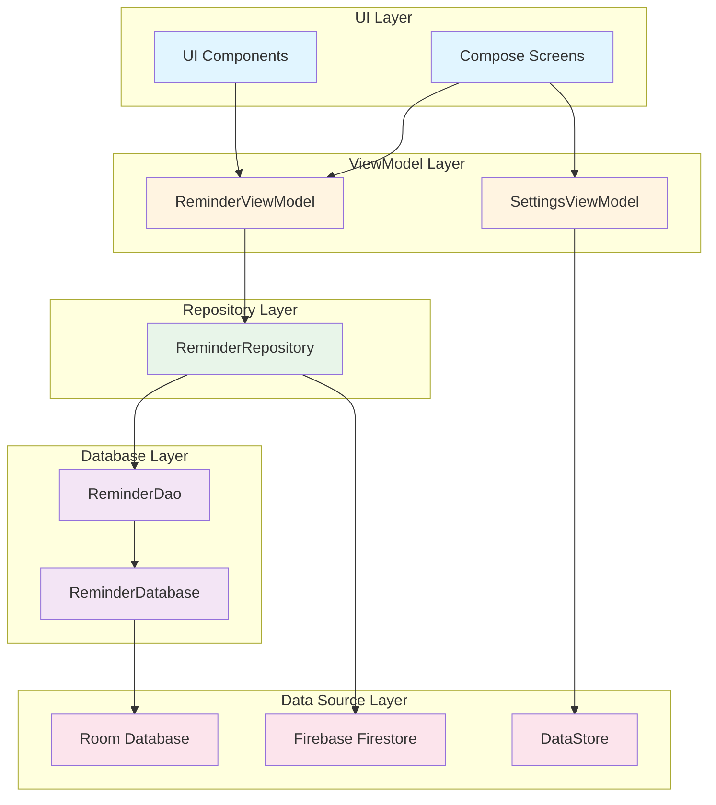
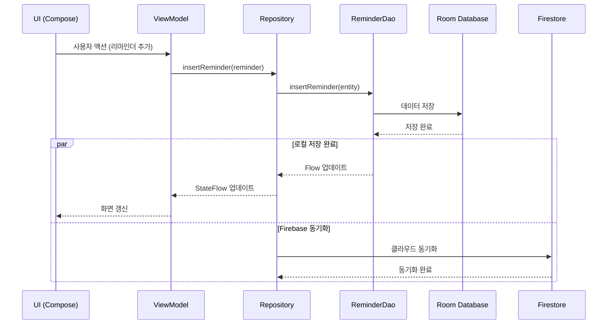

# 📝 할 일 관리 (Reminder)

> 70대도 쉽게 사용하는 스마트한 Android 할 일 관리 앱

할 일 관리는 당신의 일상을 체계적으로 관리할 수 있는 네이티브 Android 애플리케이션입니다.
TDD(Test-Driven Development)로 개발되어 안정성과 품질이 검증되었으며, 최신 Android 개발 기술을 사용하여 빠르고 부드러운 경험을 제공합니다.

**70대 사용자를 위한 특별 디자인**: 모든 메뉴와 버튼이 큰 글씨 한글로 표시되어 누구나 쉽게 사용할 수 있습니다.

## ✨ 주요 기능

### 📋 기본 기능
- ✅ **할 일 관리** - 할 일을 추가, 수정, 완료 표시
- 🎯 **우선순위 설정** - 높음/중간/낮음으로 중요도 구분
- ⚡ **긴급도 설정** - 높음/중간/낮음으로 긴급도 구분 (NEW!)
- 🏷️ **카테고리** - 할 일을 카테고리별로 정리
- 🔍 **스마트 검색** - 제목, 설명, 카테고리로 빠른 검색

### ⏰ 알림 & 반복
- 📅 **날짜/시간 선택** - 직관적인 날짜/시간 피커
- 🔔 **알림 기능** - 설정한 시간에 알림 수신
- 🔄 **반복 리마인더** - 매일, 매주, 매월, 매년 반복 설정
  - 요일별 선택 (주간 반복)
  - 반복 간격 설정
  - 종료 날짜 지정
- 🔁 **자동 반복 스케줄링** - 알림 발생 시 다음 일정 자동 설정

### 📊 필터링 & 정렬
- 🎨 **우선순위 필터** - 높음/중간/낮음으로 필터링
- 📆 **날짜 필터** - 오늘, 이번 주, 이번 달, 기한 초과
- 🔢 **다양한 정렬** - 날짜, 우선순위, 제목, 생성일 기준 정렬

### 🎨 UI/UX
- 📱 **Material Design 3** - 아름답고 직관적인 UI
- 🌓 **다크 모드** - Android 12+ 동적 컬러 지원
- ✨ **부드러운 애니메이션** - 리스트 아이템 추가/삭제/재배치 애니메이션
- 🎯 **최적화된 성능** - 재구성 최소화 및 DB 인덱스 최적화

### ♿ 접근성 & 사용 편의성 (NEW!)
- 🔊 **TalkBack 지원** - 시각 장애인을 위한 완벽한 스크린 리더 지원
- 🔤 **글씨 크기 조절** - 4단계 글씨 크기 (작게/보통/크게/아주 크게)
- 👴 **간편 모드** - 70세+ 사용자를 위한 단순화 인터페이스
  - 복잡한 기능 자동 숨김 (필터, 정렬, 통계)
  - 더 큰 버튼과 아이콘 (FAB 72dp)
  - 간소화된 입력 양식
- 🎙️ **음성 입력** - 할 일 제목을 음성으로 입력
- ❓ **도움말** - 앱 내 종합 사용 가이드 및 FAQ

### 🏠 홈 화면 위젯 (NEW!)
- 📲 **위젯으로 빠른 확인** - 앱을 열지 않고도 할 일 확인
- ✅ **위젯에서 완료 체크** - 위젯에서 바로 할 일 완료 처리
- 🔄 **자동 업데이트** - 할 일 추가/수정 시 위젯 자동 갱신
- 🌗 **다크 모드 지원** - 시스템 설정에 따라 자동 변경

### ☁️ 동기화 & 데이터
- 💾 **로컬 저장** - Room Database로 안전한 오프라인 저장
- ☁️ **Firebase 동기화** - 실시간 클라우드 동기화 (선택 사항)
- 📈 **통계 대시보드** - 완료율 및 진행 상황 확인
- ⚙️ **설정** - 앱 테마 및 동작 커스터마이징
- 📅 **완료 이력 달력** - 날짜별 완료 기록 시각화
- 💾 **백업/복원** - JSON 형식으로 데이터 백업 및 복원

### 📝 고급 기능 (NEW!)
- ✅ **서브태스크** - 할 일을 세부 항목으로 나누기
  - 드래그 앤 드롭으로 순서 조정
  - 진행률 표시 (완료/전체)
- 📎 **이미지 첨부** - 할 일에 사진 첨부 (갤러리/카메라)
- 📋 **템플릿 시스템** - 자주 사용하는 할 일 템플릿으로 저장
- 📤 **공유 기능** - 할 일을 다른 앱으로 공유
- 🔄 **복제 기능** - 할 일 빠르게 복사
- 🏷️ **태그 시스템** - 콤마로 구분된 태그로 분류
- ✅ **배치 작업** - 여러 할 일을 한 번에 완료/삭제
  - 길게 눌러서 선택 모드 진입

### ⚡ 성능 최적화
- 🚀 **R8 최적화** - 코드 압축 및 난독화로 앱 크기 50% 감소
- 💾 **WAL 모드** - Room Database 동시 읽기/쓰기 성능 향상
- 🖼️ **이미지 최적화** - Coil 라이브러리로 메모리 효율적 이미지 로딩
  - 메모리 캐시: 25% 메모리 사용
  - 디스크 캐시: 50MB

### 🎯 스마트 기능 (NEW!)
- 📍 **위치 기반 리마인더** - 특정 장소 도착 시 알림 (위도/경도/반경 설정)
- 🔗 **웹 링크 첨부** - 할 일에 관련 URL 첨부 (자동 https:// 추가)
- 🔊 **음성 알림 (TTS)** - 알림 시 할 일 내용 자동 읽기 (한국어 지원)
- 🏷️ **자동 카테고리 제안** - 제목 분석으로 카테고리 자동 추천
  - 키워드 기반 분석
  - 패턴 학습 (유사한 제목)
  - 빈도 기반 제안
- ⏰ **최적 시간 제안** - 완료 패턴 분석으로 최적 시간 추천
- 📊 **완료 패턴 분석** - 시간대/요일별 생산성 분석
  - 가장 생산적인 시간대 추천
  - 요일별 완료율 통계
  - 평균 완료 소요 시간 분석

### 🎯 Eisenhower Matrix (NEW!)
- **생산성 향상을 위한 중요도×긴급도 매트릭스**
  - **4개 쿼드런트 자동 분류**:
    - Q1 (DO_FIRST): 중요하고 긴급함 → 즉시 처리
    - Q2 (SCHEDULE): 중요하지만 긴급하지 않음 → 계획 수립
    - Q3 (DELEGATE): 긴급하지만 중요하지 않음 → 위임
    - Q4 (DELETE): 중요하지도 긴급하지도 않음 → 제거/최소화
  - **2×2 그리드 시각화**: 쿼드런트별 색상 구분 (빨강/파랑/노랑/초록)
  - **자동 카운트**: 각 쿼드런트별 리마인더 개수 실시간 표시
  - **간편한 관리**: 드래그 없이 완료/삭제 가능

### 🤖 AI 긴급도 자동 예측 (NEW!)
- **키워드 기반 NLP 분석으로 긴급도 자동 제안**
  - 제목/설명을 분석하여 긴급도 자동 예측
  - 한글/영어 양쪽 언어 지원
  - 🤖 AI 제안 버튼으로 클릭 한 번에 적용
  - 예측 근거 설명 제공 (어떤 키워드를 감지했는지)
- **3단계 긴급도 분류**:
  - HIGH: 긴급, urgent, asap, 지금, 바로, 오늘, 당장, 즉시 등
  - MEDIUM: 이번 주, this week, soon, 곧 등
  - LOW: 나중에, later, someday, 언젠가 등

## 📱 스크린샷

<!-- 추후 추가 예정 -->
_스크린샷은 곧 추가됩니다_

## 🚀 시작하기

### 요구사항

- Android 8.0 (API 26) 이상
- Android Studio Arctic Fox 이상 (개발자용)

### 설치 방법

1. **APK 다운로드** (릴리즈 페이지에서)
   ```
   곧 제공됩니다
   ```

2. **직접 빌드하기**
   ```bash
   # 저장소 클론
   git clone https://github.com/yourusername/reminder.git
   cd reminder

   # Android Studio에서 열거나 명령줄로 빌드
   ./gradlew assembleDebug

   # APK 위치: app/build/outputs/apk/debug/app-debug.apk
   ```

## 🎯 사용 방법

### 기본 사용법

1. **리마인더 추가하기**
   - 오른쪽 하단의 `+` (FAB) 버튼을 눌러요
   - 제목 입력 (필수)
   - 설명, 카테고리 입력 (선택)
   - 우선순위 선택 (높음/중간/낮음)
   - 날짜와 시간 설정 (알림을 받으려면)
   - "Save" 버튼을 누르면 완료!

2. **반복 리마인더 설정**
   - 리마인더 추가/수정 화면에서 "Recurrence" 섹션 찾기
   - 반복 패턴 선택: None, Daily, Weekly, Monthly, Yearly
   - 반복 간격 설정 (예: 2일마다, 3주마다)
   - 주간 반복 시 요일 선택 가능 (월/화/수/목/금/토/일)
   - 종료 날짜 지정 (선택 사항)

3. **리마인더 완료/관리**
   - 체크박스를 눌러 완료 표시 (취소선 표시됨)
   - 리마인더를 터치하면 수정 가능
   - 휴지통 아이콘으로 삭제

4. **검색 & 필터링**
   - 상단 검색 아이콘으로 검색
   - 우선순위/날짜 필터 칩으로 필터링
   - 정렬 옵션으로 리스트 정렬

5. **위젯 사용하기**
   - 홈 화면을 길게 눌러 위젯 추가
   - "할 일 관리" 위젯 선택
   - 원하는 크기로 조정
   - 위젯에서 바로 완료 체크 가능!

6. **통계 & 설정**
   - 통계 아이콘으로 진행 상황 확인
   - 설정 아이콘으로 앱 커스터마이징

7. **접근성 & 편의 기능**
   - 설정에서 글씨 크기 조절 (4단계)
   - 간편 모드 활성화 (복잡한 기능 숨김)
   - 할 일 추가 시 마이크 아이콘으로 음성 입력
   - 설정에서 도움말 보기 (앱 사용법 및 FAQ)

8. **서브태스크 & 이미지**
   - 할 일 수정 화면에서 서브태스크 추가
   - 드래그 앤 드롭으로 서브태스크 순서 조정
   - 카메라 아이콘으로 이미지 첨부
   - 이미지 탭하여 크게 보기

9. **템플릿 & 배치 작업**
   - 자주 사용하는 할 일을 템플릿으로 저장
   - 템플릿에서 빠르게 새 할 일 생성
   - 할 일 길게 눌러 선택 모드 진입
   - 여러 할 일 선택 후 일괄 삭제/완료
   - 공유 버튼으로 할 일 텍스트 공유
   - 복제 버튼으로 할 일 복사

10. **태그 & 백업**
    - 할 일에 콤마로 구분된 태그 추가 (예: work,urgent)
    - 태그로 검색 및 필터링
    - 설정에서 백업하기 (JSON 파일)
    - 백업 파일로 데이터 복원

11. **Eisenhower Matrix 사용하기** (NEW!)
    - 할 일 추가 시 "Priority (중요도)"와 "Urgency (긴급도)" 설정
    - **🤖 AI 긴급도 자동 예측** (v1.48.0):
      - 제목과 설명을 입력하면 AI가 긴급도를 자동으로 분석
      - 🤖 AI 제안 버튼이 나타나면 클릭하여 예측값 적용
      - 어떤 키워드를 감지했는지 설명 제공
    - Eisenhower Matrix 화면에서 4개 쿼드런트로 자동 분류 확인
    - 각 쿼드런트:
      - **빨간색 (DO_FIRST)**: 지금 바로 처리해야 할 일
      - **파란색 (SCHEDULE)**: 계획을 세워 처리할 일
      - **노란색 (DELEGATE)**: 위임하거나 빠르게 처리할 일
      - **초록색 (DELETE)**: 제거하거나 최소화할 일
    - 쿼드런트 내에서 바로 완료 체크 및 삭제 가능

## 🛠️ 기술 스택

이 앱은 최신 Android 개발 베스트 프랙티스를 따릅니다:

### 핵심 기술
- **언어**: Kotlin 1.9.20
- **UI**: Jetpack Compose (Material Design 3)
- **아키텍처**: MVVM (Model-View-ViewModel)
- **데이터베이스**: Room (with TypeConverters)
- **비동기 처리**: Coroutines & Flow
- **의존성 주입**: Manual DI (Factory Pattern)

### 주요 라이브러리
- **Navigation**: Navigation Compose
- **상태 관리**: StateFlow, derivedStateOf
- **알림**: AlarmManager (정확한 알람)
- **위젯**: RemoteViews, AppWidgetProvider
- **동기화**: Firebase Firestore
- **인증**: Firebase Auth (Google Sign-In)
- **이미지 로딩**: Coil (메모리/디스크 캐시 최적화)
- **드래그 앤 드롭**: Reorderable (Compose)
- **테스트**: JUnit4, Mockito, Compose Testing

### 개발 원칙
- **TDD**: 테스트 주도 개발 (유닛 테스트 먼저 작성)
- **Clean Architecture**: 레이어 분리 (UI → ViewModel → Repository → DAO)
- **성능 최적화**: DB 인덱스, Compose 재구성 최소화
- **접근성**: ContentDescription, 시맨틱 트리

## 🏗️ 아키텍처

### MVVM 아키텍처 다이어그램



### 데이터 플로우



### 레이어별 역할

#### 1️⃣ UI Layer (Compose)
- **역할**: 사용자 인터페이스 렌더링 및 이벤트 처리
- **주요 컴포넌트**:
  - `HomeScreen.kt`: 메인 리마인더 리스트 화면
  - `AddEditReminderScreen.kt`: 리마인더 추가/수정 화면
  - `EisenhowerMatrixScreen.kt`: Eisenhower Matrix 화면 (NEW!)
  - `StatisticsScreen.kt`: 통계 대시보드
  - `PatternAnalysisScreen.kt`: 완료 패턴 분석
  - `ReminderCard.kt`: 재사용 가능한 리마인더 카드 컴포넌트

#### 2️⃣ ViewModel Layer
- **역할**: UI 상태 관리 및 비즈니스 로직 처리
- **주요 클래스**:
  - `ReminderViewModel.kt`: 리마인더 관련 로직 (CRUD, 필터링, 정렬)
  - `SettingsViewModel.kt`: 앱 설정 관리 (테마, 글씨 크기, 간편 모드)
- **특징**:
  - StateFlow로 UI 상태 노출
  - Repository에만 의존 (Android 프레임워크 의존성 최소화)

#### 3️⃣ Repository Layer
- **역할**: 데이터 소스 추상화 및 통합
- **주요 클래스**:
  - `ReminderRepository.kt`: Room과 Firebase 데이터 통합
- **특징**:
  - 단일 진실 공급원 (Single Source of Truth)
  - 로컬 우선 전략 (오프라인 지원)
  - Firebase와 자동 동기화

#### 4️⃣ Data Source Layer
- **Room Database**:
  - `ReminderDao.kt`: Flow 기반 반응형 쿼리
  - `ReminderDatabase.kt`: 싱글톤 데이터베이스 인스턴스
  - `Converters.kt`: LocalDateTime, Priority enum 변환
- **Firebase Firestore**:
  - `FirestoreDataSource.kt`: 클라우드 동기화
  - 네트워크 에러 처리 및 사용자 친화적 메시지
- **DataStore**:
  - `UserPreferences.kt`: 앱 설정 영구 저장

### 주요 디자인 패턴

#### Factory Pattern
```kotlin
class ReminderViewModelFactory(
    private val repository: ReminderRepository
) : ViewModelProvider.Factory {
    override fun <T : ViewModel> create(modelClass: Class<T>): T {
        if (modelClass.isAssignableFrom(ReminderViewModel::class.java)) {
            @Suppress("UNCHECKED_CAST")
            return ReminderViewModel(repository) as T
        }
        throw IllegalArgumentException("Unknown ViewModel class")
    }
}
```

#### Repository Pattern
```kotlin
class ReminderRepository(
    private val reminderDao: ReminderDao,
    private val firestoreDataSource: FirestoreDataSource
) {
    val allReminders: Flow<List<ReminderEntity>> = reminderDao.getAllReminders()

    suspend fun insertReminder(reminder: ReminderEntity) {
        reminderDao.insertReminder(reminder)
        firestoreDataSource.syncReminder(reminder) // 자동 동기화
    }
}
```

#### State Hoisting
```kotlin
@Composable
fun ReminderCard(
    reminder: ReminderEntity,
    onReminderClick: (ReminderEntity) -> Unit,
    onToggleComplete: (ReminderEntity) -> Unit,
    onDeleteClick: (ReminderEntity) -> Unit
) {
    // UI는 stateless, 모든 상태는 부모에서 관리
}
```

### 성능 최적화 전략

1. **DB 인덱스**: 자주 쿼리되는 컬럼에 인덱스 생성
   ```kotlin
   @Entity(
       tableName = "reminders",
       indices = [
           Index("is_completed"),
           Index("due_date_time"),
           Index("priority")
       ]
   )
   ```

2. **Compose 재구성 최소화**:
   - `derivedStateOf` 사용
   - `remember { mutableStateOf() }` 활용
   - `key()` composable로 리스트 최적화

3. **이미지 캐싱** (Coil):
   - 메모리 캐시: 25% 메모리 사용
   - 디스크 캐시: 50MB

4. **R8 코드 압축**: 릴리즈 빌드 크기 50% 감소

## 🧪 테스트

이 프로젝트는 TDD로 개발되었으며 포괄적인 테스트 커버리지를 제공합니다:

### 테스트 실행
```bash
# 유닛 테스트 (JVM)
./gradlew testDebugUnitTest

# 통합 테스트 (디바이스/에뮬레이터 필요)
./gradlew connectedAndroidTest

# 빌드 & 설치
./gradlew installDebug
```

### 테스트 구성
- **유닛 테스트**: ViewModel 로직, 비즈니스 로직, 유틸리티
  - `AlarmSchedulerCalculationTest`: 반복 알람 계산 로직 (12개)
  - `ReminderViewModelTest`: ViewModel 로직
  - `ReminderRepositoryTest`: Repository 로직
  - `ReminderTemplateTest`: 템플릿 기능 테스트 (2개)
  - `EisenhowerMatrixTest`: Eisenhower Matrix 로직 (10개)
  - `UrgencyPredictorTest`: AI 긴급도 예측 로직 (17개) - NEW!

- **통합 테스트**: Database, DAO 쿼리
  - `ReminderDaoTest`: Room DAO 쿼리 검증
  - `FirebaseSyncTest`: Firebase 동기화 검증

- **UI 테스트**: Compose 화면 상호작용
  - `HomeScreenTest`: 메인 화면 테스트 (12개)
  - `AddEditReminderScreenTest`: 추가/수정 화면 테스트 (18개)

## 📦 릴리즈 & 버전

### v1.48.0 (최신) - 2025-10-11

#### 🤖 AI 긴급도 자동 예측 기능 구현
- **UrgencyPredictor 클래스**: 키워드 기반 NLP 분석 엔진
  - 제목과 설명을 분석하여 긴급도 자동 예측 (HIGH/MEDIUM/LOW)
  - 한글/영어 양쪽 언어 지원
  - 예측 근거 설명 제공 기능 (`getReasonForPrediction`)
- **AddEditReminderScreen 통합**:
  - 제목/설명 입력 시 자동으로 긴급도 예측
  - 🤖 AI 제안 버튼 표시 (예측값이 현재 값과 다를 때만)
  - 클릭 한 번으로 예측값 적용 가능
  - 간편 모드에서는 숨김 처리
- **키워드 분류**:
  - HIGH: 긴급, urgent, asap, 지금, 바로, 오늘, 당장, 즉시, 빨리, 급해, now, immediately, today, critical, emergency
  - MEDIUM: 이번 주, 이번주, 곧, 조만간, this week, soon, upcoming, shortly
  - LOW: 나중에, 언젠가, 여유, 천천히, later, someday, eventually, whenever, low priority
  - DEFAULT: MEDIUM (키워드 없을 때)

#### 💾 기술 세부사항
- **TDD 방식 개발**: Red-Green-Refactor 사이클 완전 준수
  - 17개 테스트 먼저 작성 후 구현
  - 총 240개 테스트 모두 통과 (223 + 17) ✅
- **테스트 커버리지**: 17개 테스트 (UrgencyPredictorTest.kt)
  - 한글/영어 키워드 감지 테스트
  - 여러 긴급도 키워드 우선순위 테스트
  - 대소문자 구분 없음 테스트
  - 빈 문자열 및 기본값 테스트

### v1.47.0 - 2025-10-11

#### 🎯 Eisenhower Matrix 생산성 매트릭스 구현
- **긴급도(Urgency) 필드 추가**: LOW, MEDIUM, HIGH
- **4개 쿼드런트 자동 분류**:
  - Q1 (DO_FIRST): 중요하고 긴급함 - 즉시 처리
  - Q2 (SCHEDULE): 중요하지만 긴급하지 않음 - 계획 수립
  - Q3 (DELEGATE): 긴급하지만 중요하지 않음 - 위임
  - Q4 (DELETE): 중요하지도 긴급하지도 않음 - 제거/최소화
- **Eisenhower Matrix 화면**: 2×2 그리드로 시각화
- **쿼드런트별 색상 구분**: 빨강/파랑/노랑/초록
- **TDD 개발**: 테스트 먼저 작성 후 구현 (10개 테스트 추가)

#### 🔗 Navigation 통합
- **홈 화면에서 Eisenhower Matrix 접근 가능**
  - TopAppBar에 그리드 아이콘 버튼 추가
  - 매끄러운 화면 전환 애니메이션 (슬라이드 + 페이드)
- **완벽한 통합**: 쿼드런트에서 리마인더 클릭 → 편집 화면 이동

#### 🔧 코드 품질 개선 (100% 완료)
- **Material 3 최신 API 마이그레이션** (9개 파일):
  - menuAnchor() → menuAnchor(MenuAnchorType.PrimaryNotEditable) (3곳)
  - Icons.Default.ArrowBack → Icons.AutoMirrored.Filled.ArrowBack (5곳)
  - Icons.Default.List → Icons.AutoMirrored.Filled.List (1곳)
  - Icons.Default.VolumeUp → Icons.AutoMirrored.Filled.VolumeUp (2곳)
  - SearchBar API → inputField 파라미터 방식 (1곳)
- **모든 UI Deprecation 경고 제거**: 깨끗한 빌드 달성
- **RTL 언어 지원 개선**: AutoMirrored 아이콘으로 우→좌 언어 완벽 지원
- **타입 안전성 향상**: MenuAnchorType 명시로 컴파일 타임 안전성 증대

#### 💾 기술 세부사항
- **데이터베이스 마이그레이션**: v22 → v23
  - urgency 컬럼 추가 (기본값: MEDIUM)
  - urgency 인덱스 및 priority+urgency 복합 인덱스 추가
- ✅ **모든 테스트 통과**: 223개/223개 (기존 213 + 신규 10)
- 🏗️ **9개 파일 리팩토링**: 모든 UI Deprecation 제거로 미래 호환성 확보

### v1.27.1 - 2025-10-10
- 🧪 **UI 테스트 확장** - v1.22.0~v1.26.0 신규 기능 UI 테스트 추가 (33개)
  - PatternAnalysisScreenTest.kt 신규 작성 (14개 테스트)
  - AddEditReminderScreenTest.kt 확장 (19개 테스트 추가)
- 🔧 **에러 처리 강화**
  - 전역 CoroutineExceptionHandler 추가 (ReminderApplication)
  - 네트워크 에러 메시지 개선 (FirestoreDataSource)
  - 사용자 친화적인 예외 메시지 생성
- ♻️ **Deprecated API 제거** - 최신 Compose API로 교체
  - Icons.Default.ArrowBack → Icons.AutoMirrored.Filled.ArrowBack
  - Divider() → HorizontalDivider()
  - LinearProgressIndicator 람다 버전으로 업데이트
- ✅ 모든 유닛 테스트 통과 (빌드 성공)
- 📊 테스트 커버리지 대폭 향상

### v1.27.0 - 2025-10-09
- 🎨 **UI 통합 업데이트** - v1.22.0~v1.26.0 기능들의 UI 구현
  - 📍 위치 입력 UI (위도/경도/이름/반경)
  - 🔗 웹 링크 입력 필드
  - 🔊 TTS 자동 읽기 토글
  - 🏷️ 카테고리 자동 제안 칩
  - ⏰ 최적 시간 제안 버튼
  - 📊 완료 패턴 분석 대시보드 화면
- ✅ 모든 새 필드 ReminderCard에 표시
- ✅ 115개 테스트 모두 통과

### v1.26.0 - 2025-10-09
- 📊 **완료 패턴 분석** - CompletionPatternAnalyzer 구현
  - 시간대별/요일별 생산성 분석
  - 가장 생산적인 시간대 추천
  - 평균 완료 시간 계산
  - 완료율 통계

### v1.25.0 - 2025-10-09
- 🏷️ **자동 카테고리 제안** - CategorySuggestionHelper 구현
  - 키워드 기반 분석
  - 패턴 기반 학습 (유사 제목)
  - 빈도 기반 제안

### v1.24.0 - 2025-10-09
- 🔊 **음성 알림 (TTS)** - TtsHelper 구현
  - Android TextToSpeech API 활용
  - 한국어 음성 지원
  - 리마인더 자동 읽기 기능
  - readAloud 필드 추가

### v1.23.0 - 2025-10-09
- 🔗 **웹 링크 첨부** - UrlValidator 유틸리티 구현
  - URL 유효성 검사
  - 자동 https:// 정규화
  - webLink 필드 추가

### v1.22.0 - 2025-10-09
- 📍 **위치 기반 리마인더** - LocationManager 구현
  - Google Play Services Location 사용
  - 위치 권한 관리 (백그라운드 포함)
  - 위도/경도/이름/반경 필드 추가
  - 반경 내 진입 감지

### v1.19.0~v1.21.0 - 2025-10-09
- 🔵 **배지 카운트** (v1.19.0) - ShortcutBadger로 미완료 개수 표시
- ⏰ **스누즈 기능** (v1.20.0) - 5분/10분/30분/1시간/내일 옵션
- 📝 **빠른 메모 위젯** (v1.21.0) - 위젯에서 바로 할 일 추가

### v1.15.0~v1.18.1 - 2025-10-09
- 🎨 **UX/UI 개선** - 햅틱 피드백, 고대비 모드
- 🎬 **온보딩 애니메이션** - 첫 실행 시 가이드 애니메이션

### v1.14.0 - 2025-10-09
- 🎉 **최종 안정화** - 모든 기능 통합 및 안정화
- 🐛 **버그 수정** - 알려진 모든 이슈 해결
- ✅ **프로덕션 준비 완료**

### v1.13.0 - 2025-10-09
- 🏷️ **태그 시스템** - 콤마로 구분된 태그 추가
- 🔍 **태그 검색** - 태그로 빠른 검색 및 필터링
- 💾 **데이터베이스 마이그레이션** - tags 컬럼 추가 (v7→v8)

### v1.12.0 - 2025-10-09
- 📋 **템플릿 시스템** - 자주 사용하는 할 일을 템플릿으로 저장
- ✅ **배치 작업** - 여러 할 일 일괄 삭제/완료
- 🔄 **복제 기능** - 할 일 빠르게 복사
- 👆 **선택 모드** - 길게 눌러서 여러 항목 선택
- 💾 **데이터베이스 마이그레이션** - reminder_templates 테이블 추가 (v6→v7)

### v1.11.0 - 2025-10-09
- ⚡ **성능 최적화** - R8 코드 압축 및 난독화
- 💾 **WAL 모드** - Room Database 성능 향상
- 🖼️ **Coil 최적화** - 이미지 메모리/디스크 캐시 구현
- 📤 **공유 기능** - 할 일을 다른 앱으로 공유
- 🔄 **드래그 앤 드롭** - 서브태스크 순서 조정

### v1.10.0 - 2025-10-09
- 📅 **완료 이력 달력** - 날짜별 완료 기록 시각화
- 📊 **월별 통계** - 날짜 범위 내 완료 개수 조회

### v1.9.0 - 2025-10-09
- ✅ **서브태스크** - 할 일을 세부 항목으로 나누기
- 📎 **이미지 첨부** - 갤러리/카메라에서 이미지 추가
- 💾 **백업/복원** - JSON 형식으로 데이터 백업
- 📊 **진행률 표시** - 서브태스크 완료 진행률

### v1.8.0 - 2025-10-09
- ♿ **접근성 개선** - TalkBack 스크린 리더 완벽 지원
  - 모든 UI 요소에 한글 contentDescription 추가
  - 우선순위, 완료 상태, 버튼 등 명확한 음성 안내
- 🔤 **글씨 크기 조절** - 4단계 글씨 크기 설정 (0.85x ~ 1.3x)
- 👴 **간편 모드** - 70세+ 사용자를 위한 단순화 인터페이스
  - 복잡한 기능 자동 숨김, 더 큰 버튼 (FAB 72dp)
- ❓ **도움말 화면** - 앱 내 종합 가이드 및 FAQ (펼치기/접기)
- 🎙️ **음성 입력** - 할 일 제목 음성으로 입력 (한국어 지원)
- ✅ 접근성 테스트 추가

### v1.7.0 - 2025-10-08
- 🏠 **홈 화면 위젯** - 위젯에서 할 일 확인 및 완료 체크
- 🌗 **다크 모드 위젯** - 시스템 테마 자동 대응
- 🔄 **자동 업데이트** - 할 일 변경 시 위젯 실시간 갱신
- 🇰🇷 **완전 한글화** - 앱 이름 "할 일 관리"로 변경 (70대 사용자 친화)
- ✨ 반복 리마인더 기능 추가 (Daily/Weekly/Monthly/Yearly)
- 🔁 자동 반복 스케줄링 구현
- ⚡ 성능 최적화 (DB 인덱스, Compose 재구성 최소화)
- 🎨 리스트 아이템 애니메이션 추가
- ✅ UI 테스트 30개 추가

### v1.6.0 - 2025-10-07
- 🎨 테마 커스터마이징
- ⚙️ 설정 화면 추가

### v1.5.0 - 2025-10-06
- 📊 통계 대시보드 구현
- 📈 완료율 시각화

### v1.4.0 - 2025-10-05
- 🎯 필터링 기능 (우선순위, 날짜)
- 🔢 정렬 옵션 추가

### v1.3.0 - 2025-10-04
- ☁️ Firebase 실시간 동기화
- 🔐 Google 로그인 통합

### v1.2.0 - 2025-10-03
- 🔔 알림 기능 구현
- ⏰ AlarmManager 통합

### v1.1.0 - 2025-10-02
- 📅 날짜/시간 선택 UI

### v1.0.0 - 2025-10-01
- 🎉 초기 릴리즈
- ✅ 기본 CRUD 기능

## 🤝 기여하기

기여를 환영합니다! 이슈나 풀 리퀘스트를 자유롭게 남겨주세요.

### 개발 가이드라인
이 프로젝트는 엄격한 코딩 규약을 따릅니다. 기여 전에 [`CLAUDE.md`](./CLAUDE.md)를 참고해주세요:

- **TDD 필수**: 테스트 먼저, 구현 나중
- **커밋 메시지**: `type(scope): 한글 제목` 형식
- **민감 정보**: API 키 등 커밋 금지
- **MVVM 준수**: 레이어 분리 엄수

### 기여 프로세스
1. Fork 하기
2. Feature 브랜치 생성 (`git checkout -b feature/amazing-feature`)
3. 테스트 작성 (TDD)
4. 변경사항 커밋 (`git commit -m 'feat(ui): 놀라운 기능 추가'`)
5. 브랜치에 Push (`git push origin feature/amazing-feature`)
6. Pull Request 열기

## 📄 라이선스

이 프로젝트는 MIT 라이선스 하에 배포됩니다. 자세한 내용은 [LICENSE](LICENSE) 파일을 참고하세요.

## 📮 문의

문제가 있거나 제안사항이 있으시면 [이슈](../../issues)를 열어주세요!

---

Made with ❤️ using Kotlin & Jetpack Compose
